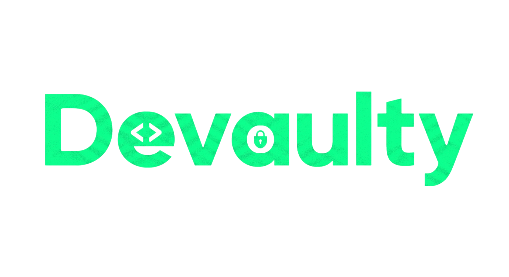

<p align="center">
  
</p>

<p align="center">
  <strong>A local-first, encrypted project management vault for developers.</strong>
</p>

<p align="center">
  <a href="#installation">Download</a> •
  <a href="#key-features">Features</a> •
  <a href="#security--privacy">Security</a> •
  <a href="#developer-documentation">Developer Docs</a>
</p>

---

## Overview

Devaulty is a desktop application designed to help software developers organize projects, store sensitive credentials, track ongoing issues, and manage code snippets — all in one place.

Built with a **local-first** philosophy, Devaulty operates entirely offline. Your data never leaves your machine and is never sent to external servers or cloud services.

---

## Security & Privacy

Security is the core foundation of Devaulty.

- **100% Offline**: No remote servers, no cloud telemetry, no account registration.
- **Local Master Password**: Your vault is locked with a master password that is never saved to disk.
- **Strong Encryption**: Key derivation uses **Argon2id** and credentials are encrypted at rest with **AES-256-GCM**.
- **Memory Protection**: Sensitive cryptographic payloads are cleared from RAM immediately after use to prevent memory inspection attacks.

---

## Key Features

- **Project Workspaces**: Group your credentials, snippets, problems, notes, and boards by project.
- **Interactive Kanban Boards**: Visual task management with customizable columns, WIP (Work In Progress) limits, priority tagging, and fluid drag-and-drop.
- **Smart `@` Mentions & Deep Linking**: Mention any project item directly inside Markdown descriptions with caret-anchored autocomplete and live preview hovercards.
- **Encrypted Credential Store**: Safely store API keys, database URLs, SSH keys, and passwords.
- **Code Snippets Vault**: Save reusable code snippets with syntax highlighting and language tag filters.
- **Problem Tracking**: Keep track of current bugs, technical debt, and blocker issues for each project.
- **Notes & Bookmarks**: Write Markdown notes and store important project links.
- **Tagging System**: Categorize any item using cross-cutting tags for quick searching.

---

## Installation

You do not need to compile from source to use Devaulty. Pre-compiled native installers are available for Linux, Windows, and macOS.

1. Go to the [Releases](../../releases) page of this repository.
2. Download the package for your operating system:
   - **Linux**: `.AppImage` (portable), `.deb` (Debian/Ubuntu), or `.rpm` (Fedora/RHEL)
   - **Windows**: `.exe` (NSIS installer)
   - **macOS**: `.dmg` package
3. Install and run the application.

---

## Developer Documentation

If you want to contribute, inspect the codebase, or build Devaulty from source, refer to the component documentation:

- ⚙️ **[Backend Documentation](backend/README.md)** — Go architecture (Hexagonal), SQLite persistence, embedded migrations, and security handlers.
- 🎨 **[Frontend Documentation](frontend/README.md)** — React, Vite, TypeScript, and Tauri v2 shell integration.

## MCP Integration

Devaulty exposes an MCP (Model Context Protocol) server through the backend binary, letting AI agents (Claude, Cursor, etc.) read and write project data — boards, cards, notes, snippets, problems, tags. It has **no access to the Vault/credentials module**.

The MCP server is not a background daemon: an MCP client launches it on demand and talks to it over stdio. It runs standalone — it does **not** require the Devaulty app to be open.

### 1. Open Devaulty at least once

On first launch, the app installs a small stable command at a fixed path, pointing to the backend binary bundled with your installation. This step is required once per install/update — after that, the MCP server works whether the app is open or closed.

### 2. Point your MCP client to that path

| OS | Path |
|---|---|
| Linux | `${XDG_CONFIG_HOME:-$HOME/.config}/devaulty/bin/devaulty-backend` |
| macOS | `~/Library/Application Support/devaulty/bin/devaulty-backend` |
| Windows | `%APPDATA%\devaulty\bin\devaulty-backend.bat` |

Example configuration:

```json
{
  "mcpServers": {
    "devaulty": {
      "command": "/home/<user>/.config/devaulty/bin/devaulty-backend",
      "args": ["mcp"]
    }
  }
}
```

Optional flags, appended to `args`:
- `--readonly` — only register read-only tools.
- `--disable-delete` — disable destructive delete tools.

### Running from source

If you're building from source instead of using a packaged install:

```bash
go run ./backend/cmd/api mcp
```

This is the standard MCP pattern: the client starts the server when needed; the app itself does not expose a public network endpoint for MCP.

---

## License

Devaulty is distributed under the **[PolyForm Noncommercial License 1.0.0](LICENSE)**.

- **Permitted**: Noncommercial use, personal customization, educational research, and open-source contributions.
- **Prohibited**: Commercial exploitation, reselling, or distribution for monetary compensation.

---

<p align="center">
  <br/>
  <sub>Devaulty — Keep your developer workflow secure and organized.</sub>
</p>