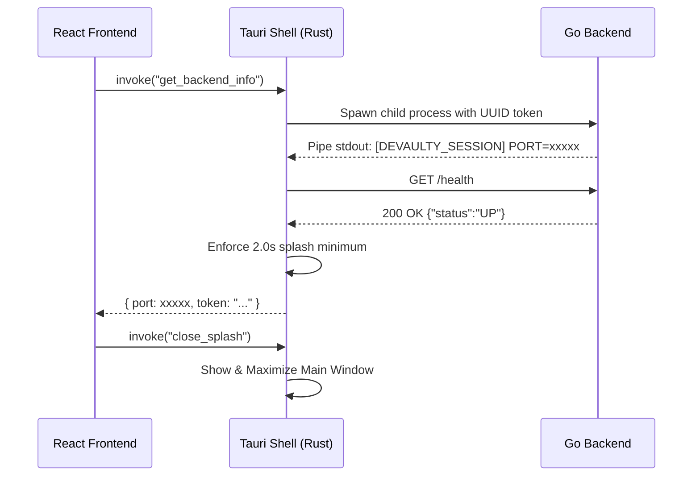

<p align="center">
  
</p>

<h1 align="center">Devaulty Frontend & Desktop Shell</h1>

<p align="center">
  <strong>Modern, feature-driven React application coupled with a high-performance Rust desktop shell (Tauri v2).</strong>
</p>

---

## 📐 Overview

The Devaulty frontend is organized into two primary layers:

1. **React Web UI (`src/`)**: A fast, responsive Single Page Application (SPA) built with React 19, TypeScript, and Vite.
2. **Tauri v2 Desktop Shell (`src-tauri/`)**: A lightweight Rust container responsible for window management, native OS integration, and managing the local Go backend lifecycle.

---

## 🎨 Part 1: React Application Architecture

### 1. Feature-Driven Organization (`src/features/`)

The frontend codebase follows a **Feature-Driven Architecture**. Domain features encapsulate their own API hooks, React components, and state logic:

```text
src/
├── api/            # Base Axios client & interceptors for DEVAULTY_INTERNAL_TOKEN
├── components/     # Shared global UI components (RootLayout, Sidebar, HackerLogo, ThemeProvider)
├── contexts/       # React Context providers (Sidebar, Theme)
├── features/       # Modular domain features:
│   ├── boards      # Multi-board Kanban workspace, column WIP limits, card dnd, @ mention resolution
│   ├── credentials # Encrypted credential forms & vault UI
│   ├── links       # Project bookmark links
│   ├── notes       # Markdown note editor & renderer
│   ├── problems    # Technical debt & issue tracker
│   ├── projects    # Workspace management
│   ├── releases    # App update notifications & modal
│   ├── security    # Master password unlock & setup modals
│   ├── snippets    # Monaco Code Editor integration & snippet manager
│   └── tags        # Cross-entity tagging UI
├── hooks/          # Shared custom hooks (useTheme, useSidebar)
├── routes/         # TanStack Router file-based pages
└── utils/          # Helper functions & Lucide icon resolution
```

### 2. State & Data Fetching (TanStack Stack)

- **TanStack Router**: Provides type-safe file-based client routing.
- **TanStack React Query**: Manages async server state, caching, optimistic updates, and background revalidation.

### 3. Rich UI Components & Editors

- **Kanban Drag-and-Drop (`@dnd-kit`)**: High-performance, accessible 60fps drag-and-drop system powering Kanban columns and cards.
- **Monaco Editor (`@monaco-editor/react`)**: Embedded VS Code editor powering the code snippets vault.
- **Markdown Processing (`marked` + `dompurify`)**: Renders markdown notes and card descriptions securely with XSS sanitization.
- **Lucide Icons (`lucide-react`)**: Dynamic icon resolution for project badges and UI navigation.
- **Sonner (`sonner`)**: Clean toast notifications for user interactions.

---

## 🦀 Part 2: Tauri v2 Desktop Shell & IPC Integration

The desktop shell is built in Rust using **Tauri v2** (`src-tauri/`). It bridges the React frontend with the native Go backend executable.

### 1. Backend Process Lifecycle

When Devaulty is launched:

1. **Binary Location**: The Rust shell checks `app.path().resource_dir()` for the bundled Go binary (`devaulty-backend` or `devaulty-backend.exe`).
2. **Dynamic Session Token**: A cryptographically random UUID v4 token is generated in memory.
3. **Child Process Spawn**: Rust spawns the Go backend as a child process, injecting `DEVAULTY_INTERNAL_TOKEN` and `DEVAULTY_DATA_DIR` into its private environment.
4. **IPC Handshake**: Rust reads the Go backend's `stdout` pipe to extract the dynamically bound HTTP port.

### 2. Splash Screen & Health-Check Flow

To provide a smooth startup experience and guarantee API readiness:

- **Phase 1 (Handshake)**: Rust waits for `[DEVAULTY_SESSION] PORT=xxxxx TOKEN=...` via the stdout pipe.
- **Phase 2 (HTTP Health Check)**: Rust polls `GET http://127.0.0.1:{port}/health` using `reqwest` until receiving a `200 OK` response.
- **Phase 3 (Splash Duration)**: Rust enforces a **minimum 2.0-second display duration** for the splash screen window (`/splash.html`) before transitioning to the maximized main window.



### 3. Multi-Platform Packaging

The desktop app is packaged using Tauri's cross-platform bundler into native installers:

- **Linux**: `.AppImage` (portable), `.deb` (Debian/Ubuntu), and `.rpm` (Fedora/RHEL)
- **Windows**: `.exe` (NSIS installer)
- **macOS**: `.dmg` disk image

---

## 🛠️ Build Automation & Helper Scripts

The `scripts/` directory contains cross-platform Node.js automation scripts:

- **`scripts/build-all.js`**:
  1. Cleans residual cross-platform binaries from `src-tauri/resources/`.
  2. Compiles the Go backend into an optimized native binary (`go build -ldflags="-s -w"`).
  3. Runs `sync-version.js`.
  4. Bundles the React frontend via `npx vite build`.
- **`scripts/sync-version.js`**:
  - Reads `version` from `package.json` (Source of Truth).
  - Updates `src-tauri/Cargo.toml`.
  - Normalizes version for `src-tauri/tauri.conf.json` (extracting `Major.Minor.Patch` for MSI & macOS bundler compatibility).

---

## 🚀 Running Locally & Development Workflows

### 1. Browser Development Mode (Standalone Web UI)
Run the React application directly in any web browser for fast UI design, CSS styling, and standard browser DevTools:

```bash
# Start Vite development server (runs at http://localhost:5173)
npm run dev
```
*Note: Run the Go backend concurrently (`APP_ENV=dev go run ./cmd/api/` in the `backend/` directory) to enable local API requests.*

### 2. Desktop Tauri Development Mode (Native Window + HMR)
Run the application inside a native desktop window with Hot Module Replacement (HMR) and live Rust IPC integration:

```bash
# Launch native Tauri dev window connected to Vite dev server
npm run tauri dev
```

### 3. Production Build Preparation
```bash
# Compile Go backend binary, sync versions, and bundle Vite web assets
npm run build:all

# Package into native installer (e.g. Linux .deb)
npm run build:deb # or: npx tauri build
```
